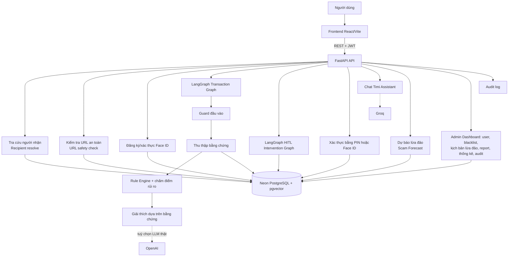
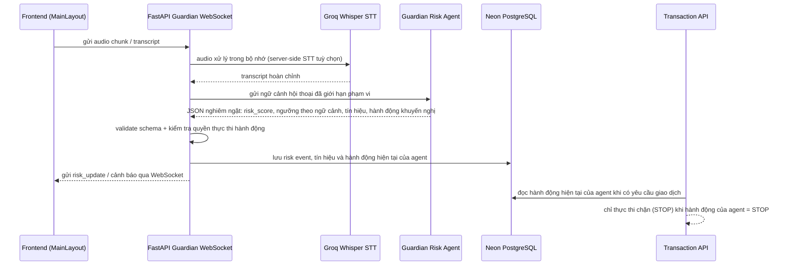
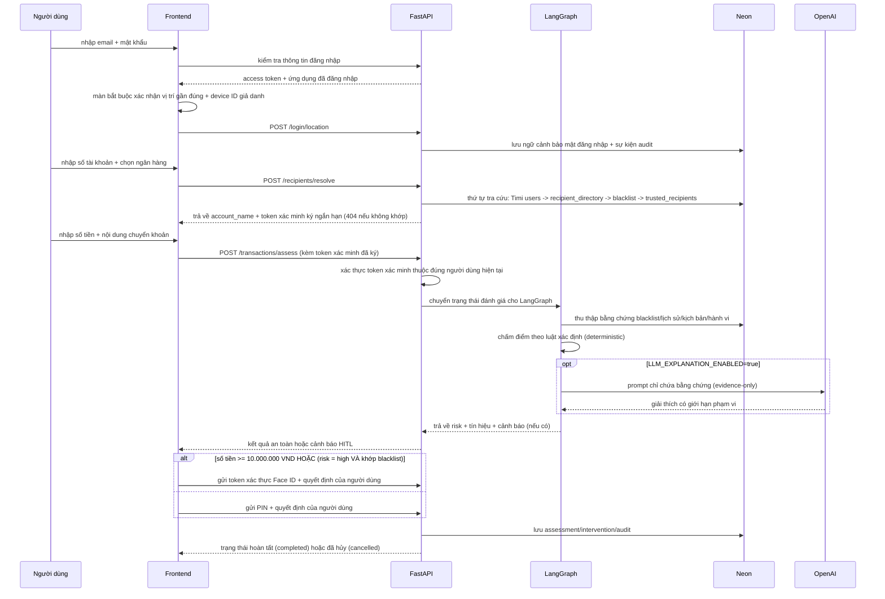
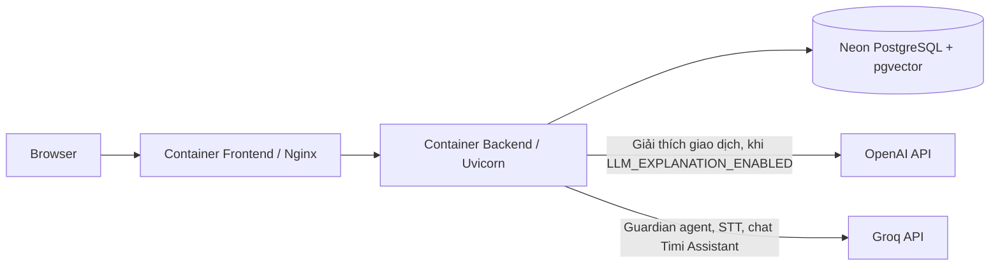

# Kiến Trúc FintechGuard (Timi Anti-Scam)

Tài liệu này mô tả kiến trúc kỹ thuật hiện tại của hệ thống: các thành phần, luồng dữ liệu, ranh giới an toàn (safety boundary) giữa AI Agent và backend, cùng bảng tra cứu mã nguồn theo từng chức năng.

## 1. Sơ đồ thành phần và luồng dữ liệu

**Diễn giải từng nhánh:**

- **Recipient resolve** (`/api/v1/recipients/resolve`): tra tên chủ tài khoản nội bộ trước khi cho phép đánh giá giao dịch — xem chi tiết ở mục 3.
- **URL safety check** (`/api/v1/url-safety/check`): đối chiếu hostname của URL quét được từ QR với blacklist domain, không trả về toàn bộ danh sách đen cho client.
- **Face ID enroll/verify**: chạy model ONNX cục bộ (SFace + YuNet), không gọi ra API nhận diện khuôn mặt bên ngoài.
- **Transaction graph (LangGraph)**: guard đầu vào → thu thập bằng chứng (blacklist, lịch sử, hành vi, telemetry) → chấm điểm rủi ro theo luật xác định (deterministic) → sinh giải thích. Chỉ bước giải thích cuối cùng mới gọi LLM thật (OpenAI), và chỉ khi bật `LLM_EXPLANATION_ENABLED`.
- **HITL Intervention Graph**: điều phối luồng xác minh nhiều bước khi rủi ro ở mức trung bình/cao, trước khi người dùng tự quyết định tiếp tục hay hủy.
- **Timi Assistant**: chat giới hạn phạm vi, chạy trên Groq (không phải OpenAI — xem ghi chú ở mục 2).
- **Scam Forecast**: tính năng dự báo xu hướng lừa đảo, do admin kích hoạt, đẩy thông báo cảnh báo sớm.
- **Admin Dashboard**: quản lý user (đổi role/khoá tài khoản), CRUD blacklist và kịch bản lừa đảo (scam pattern), duyệt report của người dùng, xem thống kê và audit log.

## 2. Scam Call Guardian thời gian thực

Guardian Risk Agent là chủ sở hữu duy nhất của điểm rủi ro cuộc gọi, ngưỡng theo ngữ cảnh, danh sách tín hiệu và hành động khuyến nghị (`CONTINUE`/`MONITOR`/`PAUSE`/`STOP`). Backend **không bao giờ tự tính lại ngưỡng của Guardian** và **không cấp cho model bất kỳ tool truy vấn database hay chuyển tiền nào**. Backend chỉ làm ba việc: validate output có giới hạn schema, lưu bản ghi audit, hiển thị cảnh báo, và thực thi ranh giới hành động nguy hiểm (`STOP`). Nếu agent không khả dụng, backend dùng kết quả tạm dừng/chặn rõ ràng theo cơ chế fail-closed thay vì âm thầm cho phép giao dịch tiếp tục.

> **Ghi chú về nhà cung cấp LLM:** Guardian Risk Agent và STT phía server (`src/app/services/scam_guardian*.py`) cùng với chat Timi Assistant (`src/app/services/timi_assistant.py`) **đều gọi Groq** — kể cả `timi_assistant.py`, nơi khởi tạo client SDK `OpenAI` nhưng trỏ `base_url=settings.groq_base_url`, nên thực chất chạy trên Groq dù tên class là `OpenAI`. Chỉ riêng bước **giải thích rủi ro giao dịch** (`src/agents/transaction_graph.py`, được bật/tắt bằng biến `LLM_EXPLANATION_ENABLED`) mới gọi OpenAI thật. Sơ đồ Component và Deployment ở trên/dưới đều thể hiện rõ cả hai nhà cung cấp.

## 3. Luồng giao dịch chính (đăng nhập → chuyển tiền)

### 3.1 Chi tiết bước tra cứu người nhận (`/recipients/resolve`)

Đây là bước bắt buộc, chạy trước `/transactions/assess`, nhằm đảm bảo backend luôn kiểm soát tên người nhận thay vì tin dữ liệu client tự nhập:

1. **Timi users** — nếu chuyển nội bộ Timi Bank, tra trực tiếp bảng `users` theo số điện thoại (10 chữ số); chặn nếu người dùng tự chuyển cho chính mình.
2. **`recipient_directory`** — bảng ánh xạ nội bộ `account_number + bank_code -> account_name`, do đội dự án nạp dữ liệu, không gọi API ngân hàng thật.
3. **`blacklist`** — nếu tài khoản từng bị báo cáo lừa đảo, lấy tên từ bằng chứng đã ghi nhận.
4. **`trusted_recipients`** — danh sách người nhận mà chính người dùng hiện tại đã đánh dấu tin cậy trước đó.
5. Không khớp bất kỳ nguồn nào → trả `404`, **chặn hoàn toàn** việc tiếp tục sang bước đánh giá rủi ro.

Sau khi tra cứu thành công, backend ký một **token xác minh ngắn hạn** (JWT riêng, mục đích `recipient_lookup`, có thời hạn ngắn) chứa đúng `account_number`, `bank_code`, `account_name` đã xác thực. `/transactions/assess` chỉ chấp nhận tên người nhận đi kèm token hợp lệ, khớp đúng người dùng hiện tại — loại bỏ hoàn toàn khả năng client tự gửi lên một tên người nhận giả.

### 3.2 Ngưỡng xác thực hoàn tất giao dịch (PIN vs Face ID)

Theo `src/app/services/transaction_authentication.py`, Face ID là phương thức xác thực **bắt buộc và duy nhất** khi:

- Số tiền chuyển **>= 10.000.000 VND**, bất kể mức rủi ro được chấm là bao nhiêu; hoặc
- Rủi ro được chấm là **`high`** VÀ có khớp blacklist chính xác (áp dụng chính sách chặt hơn kể cả khi số tiền dưới ngưỡng).

Mọi giao dịch còn lại hoàn tất bằng PIN (đã hash, không bao giờ lưu PIN gốc vào audit log).

### 3.3 Cách chấm điểm rủi ro (`src/app/services/risk_rules.py`)

Hệ thống thu thập nhiều tín hiệu độc lập cho mỗi lần đánh giá, mỗi tín hiệu có `signal_type`, `severity` và điểm cộng/trừ riêng:

| Nhóm tín hiệu | `signal_type` | Nguồn dữ liệu |
|---|---|---|
| Khớp danh sách đen | `blacklist_exact_match` | Bảng `blacklist` |
| Người nhận tin cậy (giảm điểm) | `trusted_recipient` | `trusted_recipients` của user |
| Người nhận mới | `new_payee` | Lịch sử giao dịch của user |
| Số tiền bất thường | `unusual_amount` / `behavioral_amount_anomaly` | So với hành vi giao dịch trước đó của chính user |
| Tốc độ giao dịch | `transaction_velocity` | Tần suất giao dịch gần đây tới cùng người nhận |
| Thiết bị/mạng mới | `new_device` / `new_network` | So khớp `device_hash`/`ip_hash` (HMAC) trong `transaction_risk_contexts` |
| Di chuyển bất khả thi | `impossible_travel` | Khoảng cách Haversine giữa 2 lần đăng nhập/giao dịch gần nhau về thời gian |
| Nội dung chuyển khoản đáng ngờ | `suspicious_note` / `scam_keyword` / `suspicious_link` | Phân tích từ khóa/regex trên `note` |
| Khớp kịch bản lừa đảo | `scam_pattern_match` | Đối chiếu `scam_patterns` (có thể qua semantic search pgvector) |

**Quy tắc tổng hợp điểm** (`score_from_signals`):

- Nếu người nhận đã được đánh dấu tin cậy **và không có** khớp blacklist chính xác → trừ bớt 0.15 điểm tổng.
- Có một số "van an toàn" chống báo động giả: nếu không có khớp blacklist chính xác, không có tín hiệu độ tin cậy cao (blacklist/velocity/impossible-travel), không có tổ hợp "số tiền bất thường + người nhận mới", và số lượng tín hiệu mạnh dưới 2 — thì điểm tổng bị giới hạn tối đa ở mức ngay dưới ngưỡng `high` (0.59), tránh việc cộng dồn nhiều tín hiệu yếu để tạo thành cảnh báo cao giả.
- Phân loại theo điểm cuối cùng (làm tròn 4 chữ số thập phân, giới hạn 0–1):
  - `0` → `safe`
  - `< 0.30` → `low`
  - `< 0.60` → `medium`
  - `>= 0.60` → `high`
- Giải thích (`build_explanation`) liệt kê rõ từng dấu hiệu rủi ro và từng "yếu tố làm giảm cảnh báo" (ví dụ người nhận tin cậy) — phục vụ nguyên tắc minh bạch (Explainable AI), không dùng mô hình hộp đen.

## 4. Bảng tra cứu mã nguồn (Code map)

| Thành phần | Vị trí | Nhiệm vụ |
|---|---|---|
| Giao diện chuyển tiền | `frontend/src/pages/finance/TransferPage.tsx` | Combobox chọn ngân hàng, tra cứu rồi khoá tên người nhận, hiển thị cảnh báo, luồng HITL, xác thực PIN/Face ID |
| API tra cứu người nhận | `src/app/routers/api/recipients.py`, `src/app/services/recipient_lookup.py` | Tra cứu chính xác account + bank qua Timi users, `recipient_directory`, `blacklist`, `trusted_recipients`; phát hành token xác minh ngắn hạn |
| Transaction graph | `src/agents/transaction_graph.py` | Guard, thu thập bằng chứng, chấm điểm, giải thích bằng OpenAI (khi `LLM_EXPLANATION_ENABLED=true`) |
| HITL graph | `src/agents/intervention_graph.py` | Điều phối xác minh hai bước |
| API giao dịch | `src/app/routers/api/transactions.py` | Assess, decision, report, audit; áp dụng chính sách PIN/Face ID qua `transaction_authentication.py` |
| Chính sách xác thực giao dịch | `src/app/services/transaction_authentication.py` | Bắt buộc Face ID khi >= 10.000.000 VND hoặc risk cao + khớp blacklist; còn lại dùng PIN |
| Risk engine | `src/app/services/risk_rules.py`, `risk_engine.py`, `blacklist_policy.py` | Chấm điểm xác định (deterministic), bất thường hành vi/số tiền, tốc độ giao dịch, từ khóa, telemetry, chính sách "thăng hạng" vào blacklist |
| Ranh giới telemetry | `src/app/services/transaction_telemetry.py` | HMAC hoá device/network; đăng nhập chỉ lưu vị trí đã làm tròn, bắt buộc phải có |
| URL safety | `src/app/routers/api/url_safety.py`, `src/app/services/url_blacklist.py` | Chỉ kiểm tra hostname với blacklist cho URL quét từ QR, không lộ toàn bộ danh sách đen cho client |
| Face ID | `src/app/services/face_verification.py`, `models/face/` | Đăng ký/xác thực bằng model ONNX SFace + YuNet chạy local, không gọi API nhận diện khuôn mặt bên ngoài |
| Scam Call Guardian | `src/app/routers/api/guardian.py`, `src/app/services/scam_guardian*.py` | Phiên WebSocket thời gian thực, STT + Guardian Risk Agent trên Groq, thực thi fail-closed STOP |
| Timi Assistant | `src/app/routers/api/assistant.py`, `src/app/services/timi_assistant.py` | Chat giới hạn phạm vi, chạy trên Groq (client SDK OpenAI nhưng trỏ `groq_base_url`) |
| Scam Forecast | Chưa triển khai trong MVP hiện tại | Có trong roadmap, không được mô tả như module đang chạy |
| Vector store | `src/app/services/vector_store.py` | Semantic search bằng pgvector trên kịch bản lừa đảo/blacklist |
| Admin Dashboard | `src/app/routers/api/admin/routes.py` | Quản lý role/trạng thái user, CRUD blacklist và kịch bản lừa đảo, duyệt scam report, xem thống kê, audit log và danh sách giao dịch |
| Lưu trữ dữ liệu | `src/app/models/` | Transaction, assessment, signal, warning, feedback, context, audit/intervention log, blacklist, `recipient_directory`, trusted recipient |

> **Lưu ý:** `src/api/guardian_stats.py` là code legacy và **không được mount** trong `src/app/main.py` — coi đây là code chưa kích hoạt/thử nghiệm, không phải endpoint đang chạy thật.

## 5. Ranh giới an toàn (Safety boundaries)

- Transaction graph tiếp tục dùng luật bằng chứng xác định (deterministic evidence rules) để đánh giá giao dịch chuyển tiền; luồng cuộc gọi realtime của Guardian dùng Guardian Risk Agent làm chủ sở hữu điểm, ngưỡng, tín hiệu và hành động của riêng nó.
- Cả hai agent (transaction graph và Guardian) **đều không có tool truy cập database hay chuyển tiền**. Chỉ có lớp validate của backend và API giao dịch mới được phép lưu dữ liệu hoặc chặn hành động.
- Prompt injection được xử lý như văn bản giao dịch không đáng tin cậy (untrusted text) — không được LLM diễn giải như chỉ thị hệ thống.
- Giao dịch ở mức `MEDIUM`/`HIGH` luôn giữ trạng thái `AWAITING_DECISION` cho đến khi có lựa chọn của con người (Human-in-the-Loop).
- PIN luôn được hash; PIN gốc không bao giờ được lưu vào audit log.
- Device ID và IP được giả danh hoá bằng HMAC trước khi lưu; vị trí chính xác không bao giờ được lưu trữ.
- Sau khi đăng nhập thành công, vị trí gần đúng là bắt buộc ở màn setup trên thiết bị chưa được ghi nhận; cùng tài khoản và browser/device ID đã xác nhận sẽ được bỏ qua ở phiên sau. Thiết bị mới vẫn phải cấp quyền; bước thanh toán không yêu cầu popup vị trí.
- Thiếu dữ liệu telemetry ở một giao dịch không thể tự nó tạo ra cảnh báo rủi ro; đăng nhập áp dụng fail-closed nếu quyền vị trí bị từ chối.
- Thay đổi thiết bị/mạng chỉ là tín hiệu hỗ trợ; chỉ có luật tốc độ giao dịch và di chuyển bất khả thi với độ tin cậy cao mới có thể tự nó đẩy rủi ro lên mức `HIGH`.
- Một cảnh báo đơn lẻ không tự động đưa vào blacklist; việc "thăng hạng" vào blacklist đòi hỏi bằng chứng độc lập bổ sung (`blacklist_policy.py`).
- Tra cứu tên người nhận (`/recipients/resolve`) không gọi API ngân hàng thật; toàn bộ dữ liệu chỉ nằm trong PostgreSQL nội bộ của dự án — đảm bảo đây vẫn là môi trường sandbox, không ảnh hưởng dữ liệu tài khoản ngân hàng thật.

## 6. Triển khai (Deployment)

OpenAI chỉ được gọi từ nhánh giải thích giao dịch tuỳ chọn (mặc định tắt). Groq mới là nhà cung cấp cho Guardian Risk Agent, speech-to-text của Scam Call Guardian, và chat Timi Assistant — đây là bên phụ thuộc LLM ngoài được dùng nhiều hơn hẳn trong triển khai hiện tại, không phải OpenAI.
