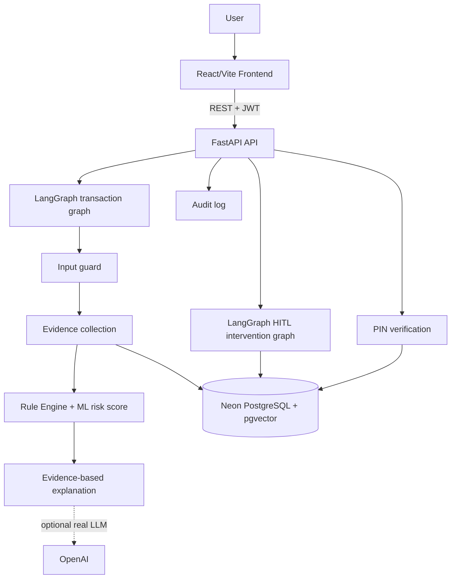
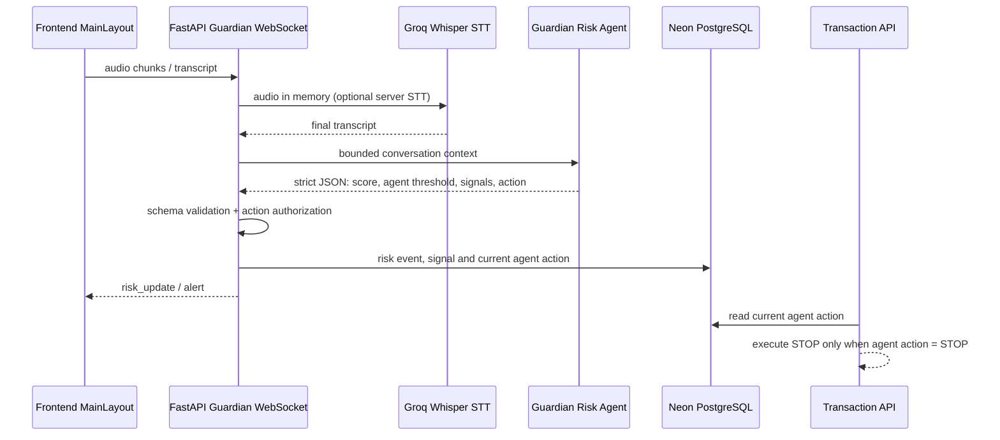
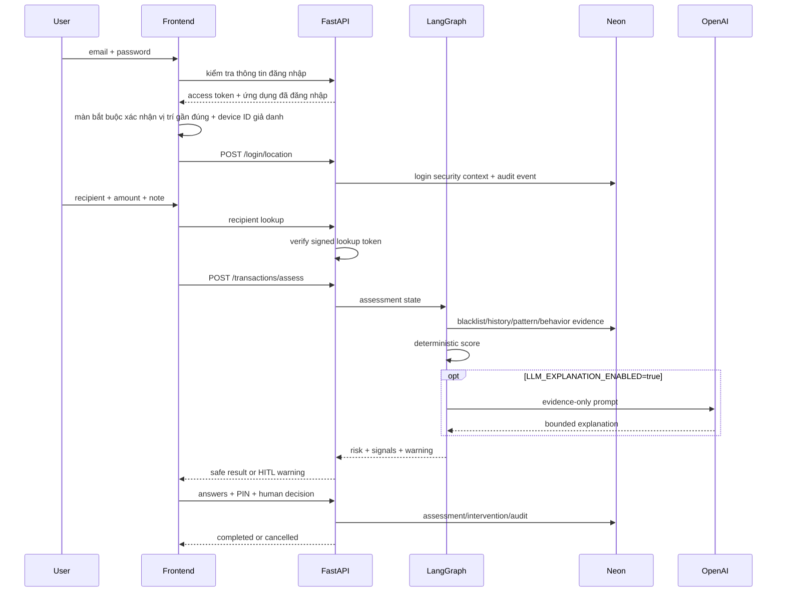
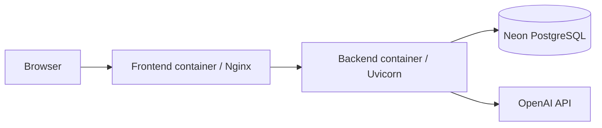

# FintechGuard Architecture

## Components and data flow

## Realtime Scam Call Guardian

The Guardian agent owns the call-risk score, contextual threshold, signals and
recommended action. The backend never recalculates a Guardian threshold and
never grants the model database or transfer tools. It only validates bounded
output, persists the audit record, displays the alert, and enforces the
dangerous-action boundary (`STOP`). If the agent is unavailable, the backend
uses an explicit fail-closed pause/stop result rather than silently allowing a
transaction.

## Main transaction flow

## Code map

| Component | Location | Responsibility |
|---|---|---|
| Frontend transfer flow | `frontend/src/pages/TransferPage.tsx` | Input, warning, HITL, PIN |
| Transaction graph | `src/agents/transaction_graph.py` | Guard, evidence, score, explanation |
| HITL graph | `src/agents/intervention_graph.py` | Two-step verification |
| API | `src/app/api/transactions.py` | Assess, decision, reports, audit |
| Risk engine | `src/app/services/risk_rules.py` | Deterministic score, behavioral amount, velocity, keywords, telemetry rules |
| Telemetry boundary | `src/app/services/transaction_telemetry.py` | HMAC device/network; login stores only rounded mandatory location |
| Persistence | `src/app/models/` | Assessment, signals, context, logs, blacklist, trusted recipients |

## Safety boundaries

- The transaction graph continues to use its deterministic evidence rules for
  transfer assessment; the realtime Guardian call path uses the Guardian Risk
  Agent as the owner of its score, threshold, signals and action.
- Both agents have no database or transfer tool. Backend validation and the
  transaction API are the only components allowed to persist or block actions.
- Prompt injection is treated as untrusted transaction text.
- MEDIUM/HIGH remains `AWAITING_DECISION` until human choice.
- PIN is hashed; raw PIN is never stored in audit logs.
- Device ID and IP are HMAC-pseudonymized before persistence; precise location is never stored.
- Sau khi đăng nhập thành công, vị trí gần đúng là bắt buộc ở màn setup trên thiết bị chưa được ghi nhận; cùng tài khoản và browser/device ID đã xác nhận sẽ được bỏ qua ở phiên sau. Thiết bị mới vẫn phải cấp quyền; bước thanh toán không yêu cầu popup vị trí.
- Missing telemetry from a transaction cannot independently create a risk alert; login is fail-closed if location permission is denied.
- Device/network changes are supporting signals; only high-confidence velocity and impossible-travel rules can independently make risk HIGH.
- One alert does not automatically blacklist; promotion requires independent evidence.

## Deployment

