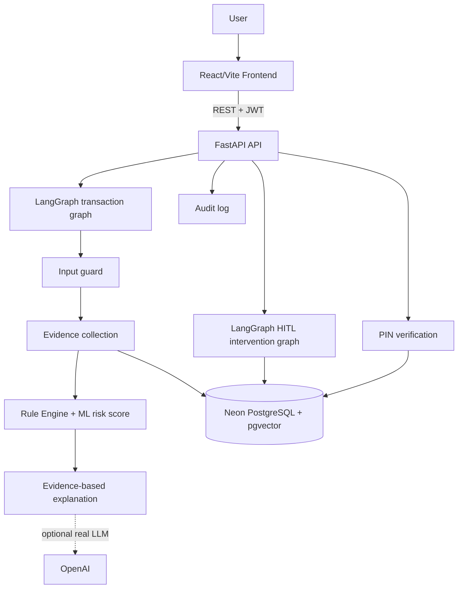
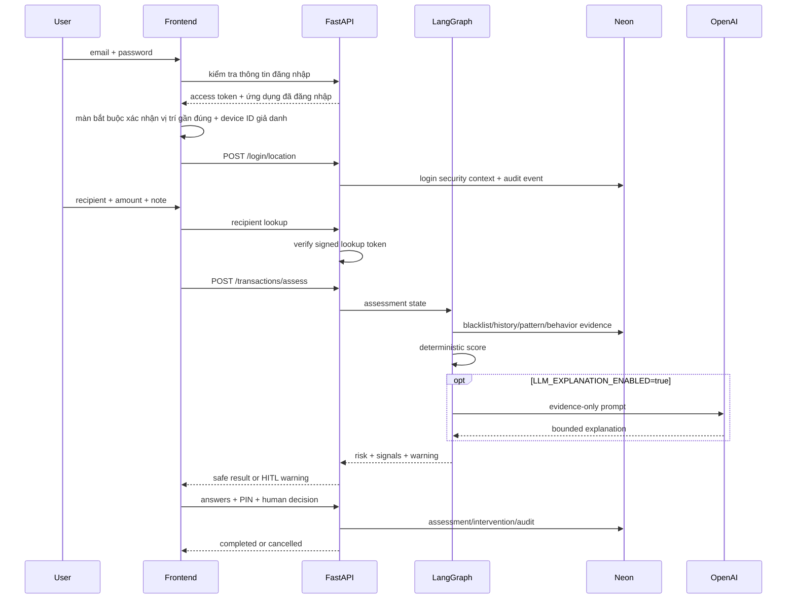
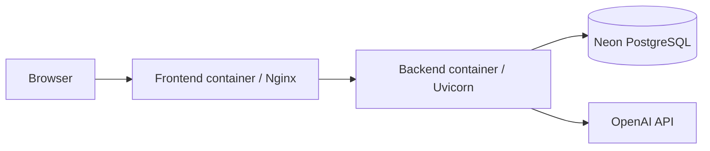

# FintechGuard Architecture

## Components and data flow

## Main transaction flow

## Code map

| Component | Location | Responsibility |
|---|---|---|
| Frontend transfer flow | `frontend/src/pages/TransferPage.tsx` | Input, warning, HITL, PIN |
| Transaction graph | `src/agents/transaction_graph.py` | Guard, evidence, score, explanation |
| HITL graph | `src/agents/intervention_graph.py` | Two-step verification |
| API | `src/app/api/transactions.py` | Assess, decision, reports, audit |
| Risk engine | `src/app/services/risk_rules.py` | Deterministic score, behavioral amount, velocity, keywords, telemetry rules |
| Telemetry boundary | `src/app/services/transaction_telemetry.py` | HMAC device/network; login stores only rounded mandatory location |
| Persistence | `src/app/models/` | Assessment, signals, context, logs, blacklist, trusted recipients |

## Safety boundaries

- Rule Engine/ML, not LLM, owns `risk_score` and `risk_level`.
- LLM has no database or transfer tool and only receives bounded evidence.
- Prompt injection is treated as untrusted transaction text.
- MEDIUM/HIGH remains `AWAITING_DECISION` until human choice.
- PIN is hashed; raw PIN is never stored in audit logs.
- Device ID and IP are HMAC-pseudonymized before persistence; precise location is never stored.
- Sau khi đăng nhập thành công, vị trí gần đúng là bắt buộc ở màn setup trước khi tiếp tục vào các trang chức năng; bước thanh toán không yêu cầu popup vị trí.
- Missing telemetry from a transaction cannot independently create a risk alert; login is fail-closed if location permission is denied.
- Device/network changes are supporting signals; only high-confidence velocity and impossible-travel rules can independently make risk HIGH.
- One alert does not automatically blacklist; promotion requires independent evidence.

## Deployment

