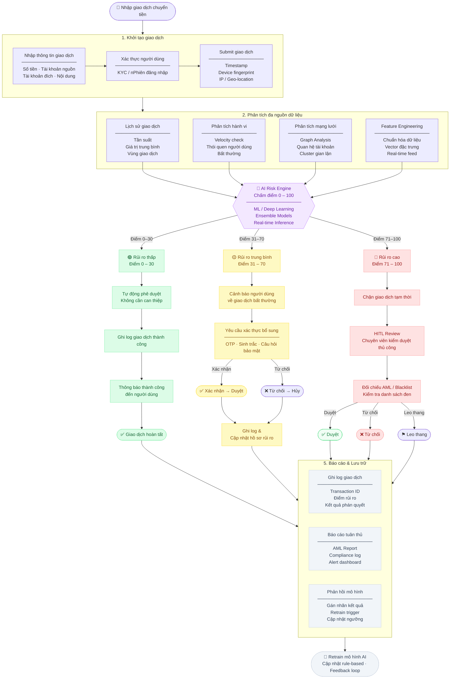

# Chi tiết luồng xử lý giao dịch vi điện tử & báo mã AI

```mermaid
flowchart TD
    %% ── Stage 1: Khởi tạo ──
    A([🔵 Nhập giao dịch chuyển tiền])

    subgraph S1["1. Khởi tạo giao dịch"]
        direction LR
        A1["Nhập thông tin giao dịch\n─────────────────\nSố tiền · Tài khoản nguồn\nTài khoản đích · Nội dung"]
        A2["Xác thực người dùng\n─────────────────\nKYC / nPhiên đăng nhập"]
        A3["Submit giao dịch\n─────────────────\nTimestamp\nDevice fingerprint\nIP / Geo-location"]
        A1 --> A2 --> A3
    end

    %% ── Stage 2: Phân tích ──
    subgraph S2["2. Phân tích đa nguồn dữ liệu"]
        direction LR
        B1["Lịch sử giao dịch\n─────────────────\nTần suất\nGiá trị trung bình\nVùng giao dịch"]
        B2["Phân tích hành vi\n─────────────────\nVelocity check\nThói quen người dùng\nBất thường"]
        B3["Phân tích mạng lưới\n─────────────────\nGraph Analysis\nQuan hệ tài khoản\nCluster gian lận"]
        B4["Feature Engineering\n─────────────────\nChuẩn hóa dữ liệu\nVector đặc trưng\nReal-time feed"]
    end

    %% ── Stage 3: AI Engine ──
    C{{"🤖 AI Risk Engine\nChấm điểm 0 – 100\n─────────────────\nML / Deep Learning\nEnsemble Models\nReal-time Inference"}}

    %% ── Stage 4: Phân loại ──
    D_LOW["🟢 Rủi ro thấp\nĐiểm 0 – 30"]
    D_MED["🟡 Rủi ro trung bình\nĐiểm 31 – 70"]
    D_HIGH["🔴 Rủi ro cao\nĐiểm 71 – 100"]

    %% Nhánh A – Thấp
    E1["Tự động phê duyệt\nKhông cần can thiệp"]
    E2["Ghi log giao dịch thành công"]
    E3["Thông báo thành công\nđến người dùng"]
    OK_LOW(["✅ Giao dịch hoàn tất"])

    %% Nhánh B – Trung bình
    F1["Cảnh báo người dùng\nvề giao dịch bất thường"]
    F2["Yêu cầu xác thực bổ sung\n─────────────────\nOTP · Sinh trắc · Câu hỏi bảo mật"]
    F_YES(["✅ Xác nhận → Duyệt"])
    F_NO(["❌ Từ chối → Hủy"])
    F3["Ghi log &\nCập nhật hồ sơ rủi ro"]

    %% Nhánh C – Cao
    G1["Chặn giao dịch tạm thời"]
    G2["HITL Review\nChuyên viên kiểm duyệt thủ công"]
    G3["Đối chiếu AML / Blacklist\nKiểm tra danh sách đen"]
    G_OK(["✅ Duyệt"])
    G_NO(["❌ Từ chối"])
    G_ESC(["⚑ Leo thang"])

    %% ── Stage 5: Báo cáo ──
    subgraph S5["5. Báo cáo & Lưu trữ"]
        direction LR
        H1["Ghi log giao dịch\n─────────────────\nTransaction ID\nĐiểm rủi ro\nKết quả phán quyết"]
        H2["Báo cáo tuân thủ\n─────────────────\nAML Report\nCompliance log\nAlert dashboard"]
        H3["Phản hồi mô hình\n─────────────────\nGán nhãn kết quả\nRetrain trigger\nCập nhật ngưỡng"]
    end

    %% ── Stage 6: Học liên tục ──
    I(["🔄 Retrain mô hình AI\nCập nhật rule-based · Feedback loop"])

    %% ── Kết nối ──
    A --> S1
    S1 --> S2
    B1 & B2 & B3 & B4 --> C

    C -->|"Điểm 0–30"| D_LOW
    C -->|"Điểm 31–70"| D_MED
    C -->|"Điểm 71–100"| D_HIGH

    D_LOW --> E1 --> E2 --> E3 --> OK_LOW

    D_MED --> F1 --> F2
    F2 -->|"Xác nhận"| F_YES
    F2 -->|"Từ chối"| F_NO
    F_YES --> F3
    F_NO --> F3

    D_HIGH --> G1 --> G2 --> G3
    G3 -->|"Duyệt"| G_OK
    G3 -->|"Từ chối"| G_NO
    G3 -->|"Leo thang"| G_ESC

    OK_LOW --> S5
    F3 --> S5
    G_OK & G_NO & G_ESC --> S5

    S5 --> I

    %% ── Styles ──
    classDef low     fill:#dcfce7,stroke:#86efac,color:#166534
    classDef med     fill:#fef9c3,stroke:#fde047,color:#854d0e
    classDef high    fill:#fee2e2,stroke:#fca5a5,color:#991b1b
    classDef ai      fill:#f3e8ff,stroke:#c084fc,color:#6b21a8
    classDef report  fill:#f1f5f9,stroke:#cbd5e1,color:#334155
    classDef outcome fill:#f0fdf4,stroke:#4ade80,color:#15803d

    class D_LOW,E1,E2,E3,OK_LOW low
    class D_MED,F1,F2,F3,F_YES med
    class D_HIGH,G1,G2,G3 high
    class G_OK outcome
    class G_NO high
    class C ai
    class H1,H2,H3,I report
```
