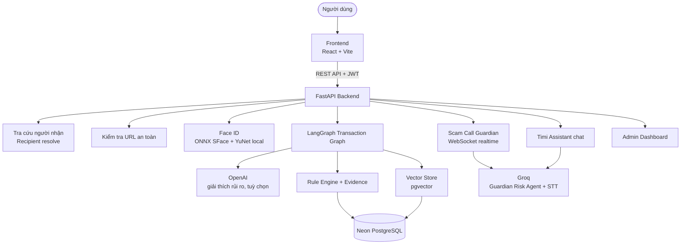
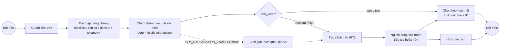

# Sơ Đồ Kiến Trúc

> Xem chi tiết đầy đủ về ranh giới an toàn, chấm điểm rủi ro và bảng tra cứu mã nguồn tại [`ARCHITECTURE.md`](../ARCHITECTURE.md). File này tóm tắt sơ đồ tổng quan hệ thống.

## Tổng Quan Hệ Thống

**Ghi chú:**

- **LLM Service** trong dự án này **không phải GPT-4o/Gemini/ChromaDB** như template gốc, mà là:
  - **OpenAI** — chỉ dùng cho bước giải thích rủi ro giao dịch (`src/agents/transaction_graph.py`), bật/tắt bằng biến `LLM_EXPLANATION_ENABLED`, mặc định tắt.
  - **Groq** — dùng cho Guardian Risk Agent, speech-to-text (Whisper) của Scam Call Guardian, và chat Timi Assistant. Đây là nhà cung cấp LLM được dùng nhiều nhất trong hệ thống.
- **Vector Store** dùng **pgvector** (extension của PostgreSQL/Neon), không dùng ChromaDB — cùng một database Neon chứ không phải service riêng biệt.
- **Database** là **PostgreSQL (Neon)**, không dùng SQLite trong môi trường triển khai chính.

## Luồng Xử Lý Của Agent (Transaction Graph)

Khác với template gốc (agent tự quyết định có gọi tool hay không rồi generate response tự do), agent trong dự án này **không tự do gọi tool và không tự quyết định chặn giao dịch**: điểm rủi ro do rule engine xác định tính toán, LLM (nếu bật) chỉ được dùng ở bước cuối để diễn giải bằng chứng đã có sẵn thành câu giải thích tự nhiên — không được phép tự đổi điểm hay tự ra quyết định chặn/cho phép.

## Chi Tiết Thành Phần

| Thành phần | Công nghệ | Vai trò |
|-----------|-----------|---------|
| Frontend | React + Vite + TypeScript, TailwindCSS, Zustand | Giao diện người dùng: đăng ký/đăng nhập, chuyển tiền, QR, Face ID, lịch sử, Admin Dashboard |
| Backend | FastAPI + Python 3.11+ | API server, xác thực JWT, điều phối agent và các service nghiệp vụ |
| Agent (giao dịch) | LangGraph (`src/agents/transaction_graph.py`, `intervention_graph.py`) | Điều phối guard → evidence → score → explanation và luồng HITL xác minh nhiều bước |
| Agent (cuộc gọi realtime) | Guardian Risk Agent (`src/app/services/scam_guardian*.py`) | Chấm điểm rủi ro cuộc gọi theo thời gian thực qua WebSocket, quyết định `CONTINUE`/`MONITOR`/`PAUSE`/`STOP` |
| LLM — giải thích giao dịch | OpenAI (tuỳ chọn, `LLM_EXPLANATION_ENABLED`) | Diễn giải bằng chứng rủi ro thành văn bản tự nhiên, không tự chấm điểm |
| LLM — Guardian & Assistant | Groq (Whisper STT + chat model) | Speech-to-text cuộc gọi, chấm điểm rủi ro cuộc gọi, chat hỗ trợ giới hạn phạm vi (Timi Assistant) |
| Face ID | OpenCV Zoo — SFace + YuNet (ONNX, chạy local) | Đăng ký/xác thực khuôn mặt, không gọi API nhận diện khuôn mặt bên ngoài |
| Database | PostgreSQL (Neon) | Lưu trữ toàn bộ dữ liệu: user, transaction, risk assessment, signal, blacklist, audit log |
| Vector Store | pgvector (extension của Neon PostgreSQL) | Semantic search cho kịch bản lừa đảo (scam pattern) và blacklist, phục vụ đối chiếu ngữ cảnh (RAG) |
| Admin Dashboard | FastAPI (`src/app/routers/api/admin/routes.py`) + Frontend | Quản lý user, blacklist, kịch bản lừa đảo, scam report, thống kê, audit log |
| Scam Forecast | Chưa triển khai trong MVP hiện tại | Có trong roadmap, chưa phải module runtime |

Xem đầy đủ sequence diagram cho luồng chuyển tiền, luồng Scam Call Guardian, ranh giới an toàn (safety boundaries) và bảng tra cứu mã nguồn chi tiết tại [`ARCHITECTURE.md`](../ARCHITECTURE.md).
